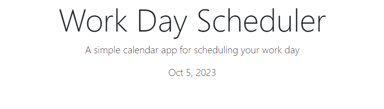
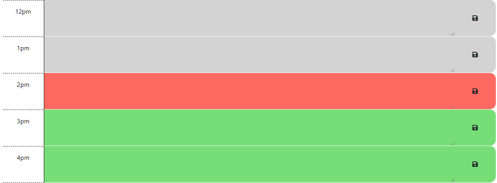

# Daily Scheduler

## Discription
This is an application designed to assist in organizing events or tasks on a day-to-day basis. It will display the current day and dynamically update based on the current hour of the day.

## Features
- Displays current day.
- Time blocks will be in gray for the past, red for current hour, and green for future hours.
- Tasks/events entered into the time blocks will be saved upon reloading the page.

*Preview of my work*

Technology Used         | Resource URL           | 
| ------------- |:-------------:| 
| HTML       | [https://developer.mozilla.org/en-US/docs/Web/HTML](https://developer.mozilla.org/en-US/docs/Web/HTML) | 
| CSS        | [https://developer.mozilla.org/en-US/docs/Web/CSS](https://developer.mozilla.org/en-US/docs/Web/CSS)      |   
| Git        | [https://git-scm.com/](https://git-scm.com/)     |    
| JavaScript | [https://developer.mozilla.org/en-US/docs/Web/JavaScript](https://developer.mozilla.org/en-US/docs/Web/JavaScript) |
| jQuery | [https://api.jquery.com](https://api.jquery.com) |
| Day.js | [https://day.js.org/](https://day.js.org) |
| Font Awesome | [https://fontawesome.com](https://fontawesome.com) | 
| Google Fonts | [https://fonts.google.com/](https://fonts.google.com/) |
| Bootstrap | [https://getbootstrap.com/docs/5.3/getting-started/introduction/](https://getbootstrap.com/docs/5.3/getting-started/introduction) |

 
 [Visit the Deployed Site](https://andrewchall92.github.io/calendar-app/)

 ## License
 This project is licensed under the [MIT License](LICENSE).